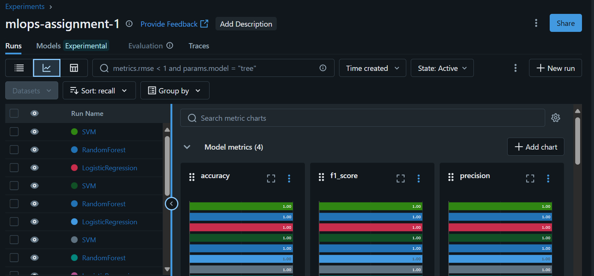
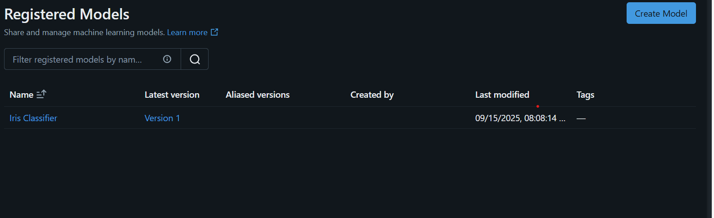

# MLOps Assignment 1 – MLflow Tracking & Model Registry

##  Problem Statement
The goal of this assignment is to train multiple ML models on a dataset, compare their performance, track experiments using **MLflow**, and register the best-performing model in the **MLflow Model Registry**.  
This helps in building reproducible workflows for ML development and deployment.

---

## Dataset
- **Dataset Used:** Iris Dataset (from scikit-learn)  
- **Features:** Sepal length, Sepal width, Petal length, Petal width  
- **Target:** Flower species (Setosa, Versicolor, Virginica)  

---

##  Models Trained & Compared
We trained the following models:
1. Logistic Regression  
2. Random Forest  
3. Support Vector Machine (SVM)  

### 🔹 Model Comparison
| Model               | Accuracy | Precision | Recall   | F1-Score |
|----------------------|----------|-----------|----------|----------|
| Logistic Regression  | 1        | 1         | 1        | 1        |
| Random Forest        | 1        | 1         | 1        | 1        |
| **SVM**              | **1.00** | **1.00**  | **1.00** | **1.00** |

 **Best Model Selected: SVM**
I selected beacuse when i sorted although every model was giving same accuracy but it came on top and as this dataset is isris which is simple thats why our model is behaving good.

---

## MLflow Tracking
We used **MLflow** to:
- Log parameters (hyperparameters of models)  
- Log metrics (accuracy, precision, recall, F1-score)  
- Log artifacts (confusion matrix plots, saved models)  

### Screenshot: MLflow Experiment Runs


---

## 🏷Model Registration
After selecting the **SVM model** as the best performer, we registered it in the **MLflow Model Registry**.

- **Model Name:** `IrisClassifier`  
- **Version:** `1`  
- **Stage:** `None` (can be moved to *Staging* or *Production* later)  

### Steps (Documented for Reproducibility):
1. Open MLflow UI.  
2. Go to **Runs** → Select the best run (SVM).  
3. Click on **Register Model**.  
4. Enter name `IrisClassifier`.  
5. Model registered with **Version 1**.  

 **Screenshot of Model Registry:**  


---

##  How to Run the Project
1. Clone this repository:  
   ```bash
  
   git clone https://github.com/nehalsalman/mlops-assignment-1
   cd mlops-assignment-1
2. Create and activate virtual environment:

python -m venv .venv
.venv\Scripts\activate     

3. Install dependencies:

pip install -r requirements.txt

4. Start MLflow tracking server:
mlflow server --backend-store-uri sqlite:///mlflow.db \
              --default-artifact-root file:./artifacts \
              --host 127.0.0.1 --port 5000

5. Run training script:
python src/train.py

6. Open MLflow UI in browser:
http://127.0.0.1:5000


